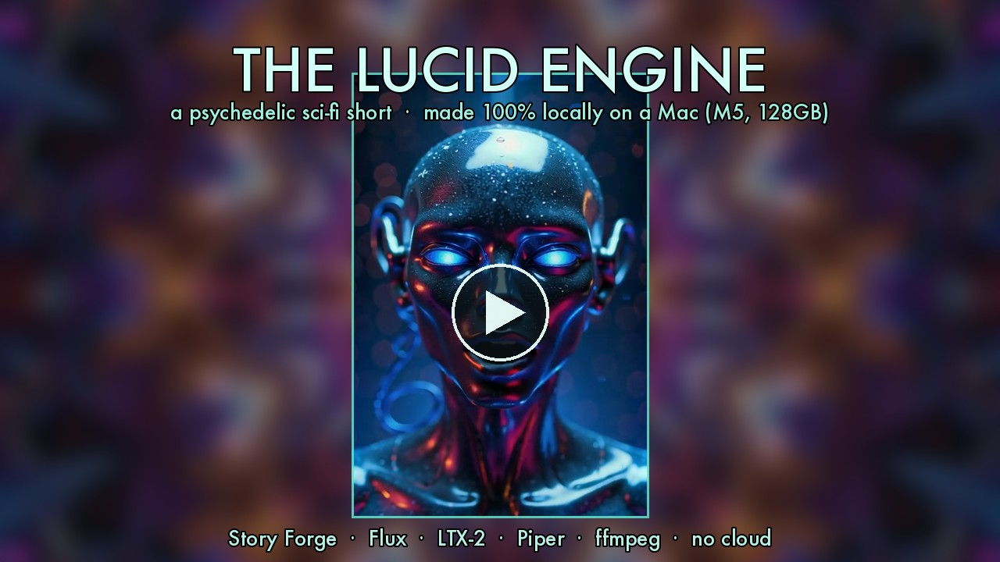
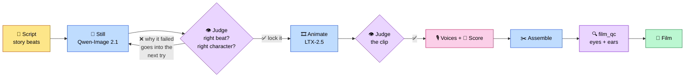

<div align="center">

# 🎬 Story Forge

### A whole film studio on one laptop. No cloud. No bill. No limits.


**Pictures ✦ motion ✦ voices ✦ original music ✦ titles ✦ a finished cut**<br>
Any kind of video, any style: explainers, documentaries, promos, music shorts, and fully animated films.

</div>

---

## 🍿 Watch the films

<table>
<tr>
<td width="50%" valign="top">

[](https://youtu.be/_bFQTl7_vF4)

### 🐻 The Bear Sister
A lost child, a mother bear, and a homecoming twenty winters later. Two acts, two art styles, **4:08**, 43 scenes.

[▶ Watch](https://youtu.be/_bFQTl7_vF4) · [📥 Download](./saga.mp4) · [📖 Read the story](./STORYBOOK.md)

</td>
<td width="50%" valign="top">

[](https://www.youtube.com/watch?v=31ZeFu-ePcc)

### 🌀 The Lucid Engine
An uploaded mind pieces together how the world ended. Psychedelic sci-fi, five acts, **~4:30**, original score.

[▶ Watch](https://www.youtube.com/watch?v=31ZeFu-ePcc) · [📥 Download](https://github.com/nicedreamzapp/story-forge/releases/tag/lucid-engine)

</td>
</tr>
</table>

> 🕰️ Both were made on the **first** pipeline (May and June 2026). Nearly every stage has been upgraded since. Here's what runs today 👇

---

## ⚡ The pipeline today



<table>
<tr>
<td width="33%" valign="top">

### 🎨 Make
- **Stills:** Qwen-Image 2.1, with each character's locked master as a reference picture
- **Motion:** LTX-2.5, about **69 seconds** per shot (it used to take 13–16 min on Wan)
- **Stunts:** real footage drives the character (Wan 2.2 Animate)

</td>
<td width="33%" valign="top">

### 🎙️ Sound
- **Narrator:** Kokoro "Heart"
- **Characters:** ChatterBox, one voice each
- **Talking close-ups:** the video is generated *from* the voice recording
- **Music:** original score from Song Forge / ACE-Step

</td>
<td width="33%" valign="top">

### 👁️ Check
- **Eyes:** Qwen3-VL-32B looks at every shot
- **Ears:** Whisper checks every line lands on time
- **Memory guard:** refuses a render the machine can't afford
- **Never:** fake a pass

</td>
</tr>
</table>

---

## 🧠 It reviews its own work

> **The story that started it:** one episode passed **86 of 91** automated checks and still made no sense. The bear was supposed to shoulder a jammed door open. Instead he poked the wall with a stick. Every check passed anyway, because none of them asked what the picture actually *showed*.

So now a local vision model judges every shot against its story beat before it's kept.

| 🚦 Gate | ❓ The question it asks |
|---|---|
| 🎯 **Beat** | Does this picture actually show what the script says happens here? |
| 🚫 **Forbidden** | Is anything in frame that rules the shot out? |
| 🐻 **Identity** | Is this still the same character as the locked master? |
| 🚂 **Set** | Is this the same train as last scene, or did it invent a new one? |
| 🦴 **Spine** | Is every beat the film can't live without actually on screen? |
| 🎤 **Technical** | Right mouth on the right line, no melting faces, every word heard on time? |
| 💾 **Memory** | Can the laptop afford this render without crashing? |

<table>
<tr>
<td width="50%" valign="top">

### ✨ Four rules that keep it honest
1. 🙈 **Judge blind first.** Describe the frame, *then* hear the beat. Tell a model the answer first and it just agrees.
2. 🗳️ **One frame isn't a verdict.** It votes across several frames and prints every ballot.
3. 📚 **Failures teach.** The reason a shot failed goes into the next attempt, and into memory for every future film.
4. 🙅 **No quiet shortcuts.** Can't pass? It's reported **UNBUILT**. Can't judge? It says **UNCHECKED**.

</td>
<td width="50%" valign="top">

### 📈 The receipts
- First run on a "finished" episode: **2 of 11 shots passed.** It spotted the stick in the door without being told.
- Rebuilding that scene: 3 of 4 tries showed the right action, **2 of those 3 drifted off-model**, and the one that passed both got locked.
- The human verdict: *"looks like he's leaning in and trying to push a door open."* ✅

</td>
</tr>
</table>

---

## 🚀 Where it stands (Sept 22, 2026)

| | |
|---|---|
| ✅ **Full films, hands-off** | The director keeps working until every beat has footage that passed. Current film: **22 of 23** beats built |
| ✅ **~10× faster animation** | LTX-2.5: **~69 s** a shot vs **13–16 min** on Wan |
| ✅ **Voice-driven close-ups** | The video is made from the voice recording, so the mouth follows real speech |
| ✅ **Firsts on a Mac** | LTX 13B running on Apple Silicon · 1-step Wan distillation · a speed harness gated on image quality |
| 🧪 **Tried, measured, dropped** | A hand-written Metal kernel (no real gain) · Bernini-R (25× slower for the same result) · Wav2Lip (paints human lips on cartoons 😬) |
| ⏳ **Next up** | The Mac mini as a second render node · finishing pass built into assembly · new engines in the chat UI |

---

## 🏁 Try it

```bash
git clone https://github.com/nicedreamzapp/story-forge && cd story-forge
./bin/sf doctor                                     # 🩺 what's missing
./bin/sf render story_forge/examples/test_tiny.sf   # 🎬 ~2 min on an M5 Max
```

Need: **ComfyUI** running · **Flux** + **Wan 2.2** / **LTX** loaded in it · **ffmpeg** · optional **piper**-compatible voice. `sf doctor` tells you what's missing.

<details>
<summary>🎛️ <b>The full gated pipeline</b> (forge / director / forge-shot)</summary>

<br>

```bash
forge new "a documentary about the harbour" --kind doc   # start a film
forge "hank and doug"                                    # pick up exactly where it stopped
forge status                                             # built · blocked · next
```

Extra requirements: mflux + Qwen-Image 2.1, [ltx-2-mlx](https://github.com/dgrauet/ltx-2-mlx), a Qwen3-VL-32B judge on MLX, and mlx-whisper. It still has some paths hard-coded to the machine it was built on. It's published so you can read the method and borrow from it.

| Tool | Job |
|---|---|
| [`forge-animatic`](bin/forge-animatic) | 🎞️ Story reel on the locked stills before anything gets animated |
| [`forge-director`](bin/forge-director) | 🎬 Keeps going until the film is done; escalates instead of repeating the same failure |
| [`forge-shot`](bin/forge-shot) | 🎯 Still → judge → lock → animate → judge the clip → trim to the part that works |
| [`build-episode`](bin/build-episode) | ✂️ Score, title cards, assembly, QC |
| [`forge-finish`](bin/forge-finish) | 🌅 Glow, color grade, contrast |
| [`film_qc.py`](pipeline-tools/film_qc.py) | 🔍 The final verdict |

Rules the code enforces: [`RULES.md`](RULES.md) · lessons from past films: [`LESSONS.json`](LESSONS.json) · speed experiments: [`RENDER_SPEED_RESEARCH.md`](RENDER_SPEED_RESEARCH.md)

</details>

<details>
<summary>📜 <b>The <code>.sf</code> script language</b></summary>

<br>

```
$style = "Studio Ghibli watercolor, soft snowfall, golden hour"
film "Cabin Open" slug=cabin_open scene_dur=8.5

voice warm:  piper/en_US-libritts_r-medium speaker=0 length=1.18
music wintry: ace/wintry-soft-piano vol=0.35
@mix duck voice -> music threshold=-22 ratio=4

scene snow_walk:
    still flux:
        prompt: "{$style}, a child in a red cloak crossing a snowfield"
    motion wan:                     # or  motion ltx:  for B-roll
        prompt: "gentle push-in, soft falling snow"
        duration: 5.0
    narrate warm:
        line: "The snow came down like a hush."
    music wintry vol=0.30
```

Parser, resolver and emitter live in [`story_forge/`](story_forge/). Full example: [`cabin_open.sf`](story_forge/examples/cabin_open.sf). `with lipsync` exists for real human faces only. It never goes on cartoon characters.

</details>

<details>
<summary>🥪 <b>Keyframe sandwich</b>: pinning the last frame too (it made things worse here)</summary>

<br>

The idea: pin the *last* frame as well as the first, so a character can't drift. On LTX 13B distilled, a walking shot came out **worse** with the anchor. At strength 1.0 the figure smeared, at 0.7 it blurred, and with no anchor it stayed clean. So it's **off by default**. If you want it: `still.end_prompt` / `still.end_path`, LTX only. Example: [`keyframe_sandwich.sf`](story_forge/examples/keyframe_sandwich.sf).

</details>

<details>
<summary>🪄 <b>Clever bits</b></summary>

<br>

- 🗣️ **Narration lines up with each scene.** Every line is placed at its scene's start time, so the audio never drifts ahead of the picture.
- 🔥 **Warm storyteller EQ.** Highpass, low-shelf warmth, softened sibilance, gentle compression, a small room echo, −16 LUFS.
- 🎚️ **Auto-ducking.** The music dips about 10 dB whenever someone speaks.
- 🏃 **Wan plays at real speed.** Nothing gets stretched into dreamy slow-mo.
- 🔀 **Engine picked per shot.** Wan for the hero shots, LTX for the atmosphere.
- 🚫 **No fake motion.** Never shakes a still, never paints mouths.

</details>

---

## 💸 Why local

| Service | Cost for a 4-min film (~51 clips) |
|---|---|
| 🟥 Runway Gen-3 | ~$204 |
| 🟧 Pika 2.0 | ~$102–153 |
| 🟨 Sora / Luma | ~$128 |
| 🟦 Kling | ~$89 |
| 🟩 **Story Forge** | **$0**, just electricity ⚡ |

No upload. No queue. No subscription. No telemetry. **Your laptop, your film.** 💚

---

<div align="center">

### 🙌 Built on the shoulders of

Qwen-Image · LTX · Wan · Flux · Kokoro · ChatterBox · ACE-Step · Qwen3-VL · Whisper · ffmpeg<br>
Full credits and licenses → [CREDITS.md](CREDITS.md)

**Code:** [MIT](LICENSE) · **Films:** [see LICENSE-ASSETS](LICENSE-ASSETS.md) (*The Bear Sister* is CC BY-NC-SA 4.0)

🐛 Something broken? [Open an issue](https://github.com/nicedreamzapp/story-forge/issues/new) with your Mac chip, RAM, and the stage that failed.

*Story by Matt Macosko + Claude · made on one MacBook Pro · zero cloud* ✨

</div>
